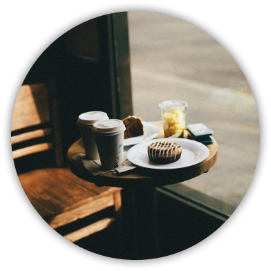

# 누구나 그럴싸한 계획이 있다.
# 마감이 닥치기 전까진.
카페W 클론 프로젝트
  - TEAM ABSOLUTE
  - position: relative; 서민기
  - top: 0; 나윤호
  - left: 0; 한병국
---
## 목표
  1. 시멘틱 마크업
    - 웹 문서를 의미적으로 파악한다.
    - 의미에 맞는 적절한 태그를 사용한다.
  2. 웹 접근성 준수
    - 노출해야 할 콘텐츠와 숨겨야 할 콘텐츠를 구분한다.
    - 학습한 aria 속성을 적극적으로 활용한다.
  3. SEO 준수
    - Light house 확장 프로그램을 기준으로 체크한다.
  4. git/github 협업
    - git, github을 활용해 히스토리를 꼼꼼히 남긴다.
    - 처음 활용하는 만큼, 발생할 문제점에 대해 적극적으로 대처한다.
  5. 한 달간의 성장 확인
    - 할 수 있는 만큼에서 두 발자국만 더 한다.
## 사용 기술
  1. html/css
  2. git/github
  3. zoom
  4. figma
  5. sprite-sheet
## 컨벤션
  1. BEM
  2. Conventional Commit
  3. vs code 설정 통일
  4. class명은 K.C. id명은 C.C로 통일
---
## 프로젝트 구조
  1. html
    - index.html: 메인 페이지
    - sign-up.html: 회원가입 페이지
    - sign-in.html: 로그인 페이지
  2. css
    - reset.css: 에이전트 스타일 제거
    - default.css: 기본 스타일 설정
    - component.css: 모듈화
    - commmon.css: 공통 부분인 헤더, 푸터 스타일
    - main.css: 메인 페이지 스타일
    - member.css: 회원가입, 로그인 페이지 스타일
    - style.css: css 파일 병합.
---
## html
  1. 페이지 섹션을 기준으로 각자 파트를 맡은 후,
  2. 작성한 초안을 다같이 코드 리뷰.
  3. 합의된 초안을 최종 마크업으로 완성.
## css
  1. 본인이 마크업하지 않은 섹션을 맡아 스타일.
  2. 본인이 마크업하지 않은 만큼 복잡하고 어려울 수 있지만,
  3. 작성된 코드를 다시 확인하고 공부한다는 생각으로 코딩.
  4. 도움이 필요한 경우엔 서로 적극적으로 서포트.
## git/github
  1. 팀 레포지토리 생성 후, 모두에게 오너 권한 부여.
  2. 머지 하는 커밋은 모두의 합의를 전제,
  3. 각자가 책임감을 가지고 머지.
  4. 문제가 생기는 것은 당연하므로, 모두가 적극적으로 대처.
---
## 마크업 방향성
```html
<div class="store-container">
  <h2 class="store__heading"><a href="#">매장 찾기</a></h2>
  <p class="store__brief">카페 W를 가까이에서 경험해보세요. <span>고객님과 가장 가까이 있는 매장을 찾아보세요!</span></p>
  <ul class="store__list">
    <li>차별화된 커피 경험을 누릴 수 있는 <span>리저브 매장</span></li>
    <li>다양한 방법으로 편리하게 즐길 수 있는 <span>드라이브 스루 매장</span></li>
    <li>함께해서 더 따뜻할수 있는 지역사회 소통 공간 <span>커뮤니티 매장</span></li>
  </ul>
  <div class="store__img">
    
    
  </div>
</div>
```
```html
<dl class="sign-up__sex">
  <dt class="label">성별<sup><span class="a11y-hidden">필수 입력</span>*</sup></dt>
  <dd>
      <input type="radio" name="sex" value="female" id="signUpFemale" checked>
      <label for="signUpFemale">여성</label>
      <input type="radio" name="sex" value="male" id="signUpMale">
      <label for="signUpMale">남성</label>
  </dd>
</dl>
```
```html
<section class="video">
  <div class="video-container">
    <h2 class="a11y-hidden">카페W 상품 가격 및 할인율 영상</h2>
    <video poster="./static/video/video-poster.jpg" controls width="100%">
      <source src="./static/video/ao11y.webm" type="video/webm">
    </video>
  </div>
</section>
```
---
## git/github
  1. 커밋 -회
  2. 이슈 -회
  3. 풀 리퀘스트 -회
---
## 구현 페이지
  1. CAFE W
    2. 로그인 및 회원 가입
    2. 검색
    2. 메뉴
    2. 공지사항
    2. Cafe W의 추천메뉴
    2. Cafe W의 추천 강좌
      3. 멀티 캠퍼스 추천 강좌
        4. 추천 강좌 1
        4. 추천 강좌 2
      3. 이듬 블렌디드 러닝 추천 강좌
        4. 추천 강좌 1
        4. 추천 강좌 2
    2. 강의 리뷰
      3. 리뷰 1
    2. 카페 W 인기 강좌
    2. 브로슈어 다운받기
    2. 카페W 상품 가격 및 할인율 영상
    2. CAFE W . RESERVE
    2. CAFE W card
    2. CAFE W COFFEE LAB
    2. 이듬 블렌디드 러닝
    2. 매장 찾기
---
## 개별 발표
  1. 서민기
    1. 아쉬웠던점:
      - Selectbox 스타일을 덮혀 씌우려고 많은 노력을 했었으나 생각처럼 잘 되지 않아 많은 시간을 소요함.  결국엔 CSS만으로 select의 option을 스타일링 할 수 있는 방법은 찾지 못했음. 이처럼 아직 경험이 부족해 어떤게 가능하고 불가능한지 몰라 검색하는데 많은 시간을 소요했고 이로 인해 다른 디테일한 부분을 놓친게 좀 아쉬웠음.
    2. 좋았던점:
      - 다른 팀원들이 마크업했던 부분을 스타일링했기 때문에 맡은 부분뿐만 아니라 전반적인 프로젝트를 이해하는데 많은 도움이 됨.이런 과정을 통해서 여러 조언들을 주고 받을수 있었고 또 고쳐야 할 부분을 명확하게 알 수 있었음.
    
  2. 나윤호
    이번 프로젝트에서 어려웠던 부분: 
      1. 담당 부분 중 추천 메뉴 섹션에서 이미지의 위치를 지정하는데 매우 어려움을 느낌.  강사님깨서 수업 중에 말씀하신 이미지 위치 지정 시 absolute를 사용하면 글자 하나가 추가 되어도 위치가 전부 바뀐다는 거시 무엇인지 확실하게 인지함 
      2. 헤더 부분 코딩 시 width값을 따로 지정하지 않고 우측에 있는 돋보기의 margin-right로 값을 지정하여 맞췄었는데 나중에 width값을 1400으로 지정해줘야 해서 돋보기의 위치를 지정하기가 힘들었음->돋보기의 마진 때문에 마진을 제거하니 헤더 전체에 영향을 끼침
  3. 한병국
    디테일한 완성도의 결과물을 만들지 못한 것이 가장 아쉽다.
    빈틈없는 시멘틱 마크업, 모듈화를 위한 스타이시트 관리, 이후 동작을 위한 세팅 등, 여러 가지 목표 사항이 있었지만 이루지 못했다.
    처음 접해 보는 협업 프로젝트이기도 하고, git과 github에도 익숙하지 않아 당황을 많이 했다.
    프로젝트 후반에는 보이는 렌더링에만 급급해 코딩을 한 것이 많이 아쉽다.
    본격적으로 코딩을 하기 전에 필요한 기획, 정리 단계가 얼마나 중요한지도 느꼈다.
    시안을 보며 궁금했던 것들, 곁에 기획자가 있었다면 더 좋았을까?
    결과물에는 아쉬움이 남지만, 협업 과정에는 만족한다.
    머리를 맞대고 고군분투하는 과정에서 배우는 것은, 단순히 개발에 관한 것만은 아니었다.
    문제를 발견하는 순간부터 해결책을 도출하는 결과까지, 의사소통의 과정에서 서로 다른 시각도 많이 배웠다.
    그 동안 혼자하는 작업에 익숙했던 내게, 더 의미 있던 시간이었다고 생각한다.
    마지막으로 개인적인 점수를 매기자면,
    결과물은 70점, 협업 과정은 100점.
    함께 해준 조원들에게 고맙다.
---
<a href="http://slides.com/minki607deck">slides.com/minki607deck</a>
